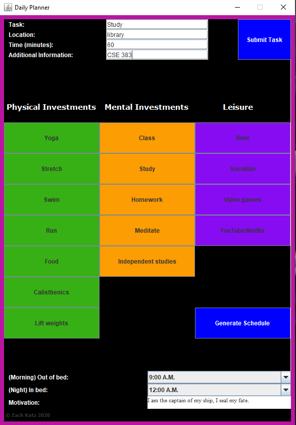
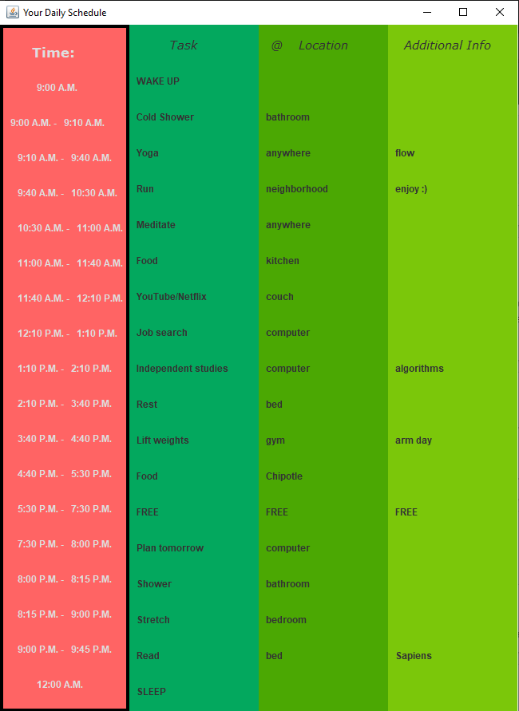

# Daily_Planner
Interface that helps you plan out your days and then creates a schedule for you.
Especially useful during the school semester when class times are very rigid and there is a lot to do in a day.

Planner interface allows you to click buttons to choose your task (or free type), also choose wake-up and sleep time.
"Submit Task" button clears the textfields at the top and saves the task.

After submitting all of your daily tasks, clicking the "Generate Schedule" button will create a schedule
with timeframes alloted based on your wake up time and the length of each task.
Example below:

